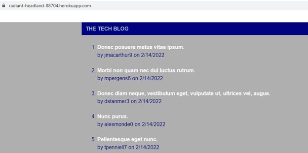

# E Commerce Database

This is a challenge project for the UC Berkeley Extension Full-Stack Developer Bootcamp Course. The challenge requires creation of a blog site that uses `handlebars` templating and a `SQL` database.

## Table of Contents

- [Usage](#usage)
- [License](#license)
- [Tests](#tests)
- [Questions](#questions)

## Usage

The application can be accessed on Heroku here: https://radiant-headland-88704.herokuapp.com/.

The home page requires a login or sign-up.  Once this is done, the user may create posts or comment on other posts.  Editing and/or deleting posts will be a future feature.

## License

This project is licensed using MIT License

See the [LICENSE](./LICENSE) file for license rights and limitations.

## Tests

No testing files are included in this repo.

## Questions

My GitHub username is stuart-rickard; please feel free to contact me through my profile [here](https://github.com/stuart-rickard).
